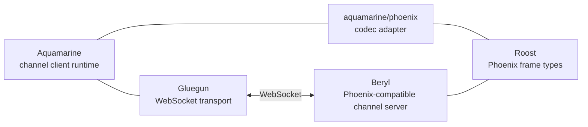

Aquamarine is one piece of a small constellation of Gleam packages that
together provide a Phoenix Channels–compatible client/server stack on
the BEAM. This page maps out where Aquamarine sits and what each of its
neighbours does.

## Package map

## What each package does

- **[Beryl](https://github.com/tylerbutler/beryl)** — the server side
  of the ecosystem. A Phoenix-compatible channel server written in
  Gleam. Aquamarine talks to Beryl, but is not coupled to it — any
  Phoenix Channels–compatible server works.
- **Aquamarine** — the protocol-agnostic client runtime. Owns the
  channel lifecycle (connect, join, push, receive, heartbeat, close)
  and delegates wire format decisions to a configurable codec.
- **`aquamarine/phoenix`** — the bundled codec adapter that makes
  Aquamarine speak the Phoenix Channels wire format. See
  [Phoenix and Beryl](/guides/phoenix/) for usage.
- **[Gluegun](https://github.com/tylerbutler/gluegun)** — the
  underlying WebSocket transport library Aquamarine uses to actually
  open the socket and move bytes.
- **[Roost](https://github.com/tylerbutler/roost)** — the Phoenix
  frame library. Provides the canonical
  `[join_ref, ref, topic, event, payload]` encode/decode and the
  protocol event-name constants. Both Aquamarine's Phoenix codec and
  the Beryl server build on it, which is why they stay in sync.

## Swapping pieces

The diagram above also shows what you can and cannot replace:

- **Codec is pluggable.** Replace `aquamarine/phoenix` with your own
  [`Codec`](/guides/codecs/) to talk to a different protocol — the
  channel runtime does not change.
- **Server is pluggable.** Aquamarine has no compile-time dependency on
  Beryl. Anything that speaks the codec you configured will work.
- **Transport is fixed.** Gluegun is currently the only transport
  Aquamarine uses for production `connect` calls. The internal
  `Transport` seam is `@internal` and exists for testing.
